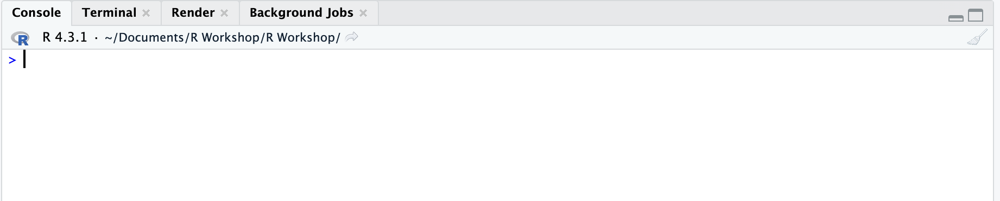
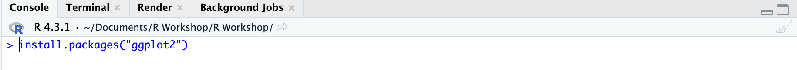

```{r setup, include=FALSE}
knitr::opts_chunk$set(echo = TRUE)
```

This tutorial will cover some of the basics of R, an open-source programming language used to manage and explore data, undertake statistical analyses and visualise data. We will make use of RStudio, which provides a user-friendly interface, making R a lot simpler to work with than just using the R console. Using R and Rstudio, we will look at:

<li>Reading in data and basic data manipulation 
<li>How to obtain summary statistics 
<li>How to undertake data visualisation</li>

<p>In this tutorial, I am not going to assume prior knowledge of the R environment. You should be able to copy and paste a lot of the information here, adapting things where you have different file and variable names. As a quick note, anything with a hash symbol (\#) at the beginning is a comment and won't run as code.

In order to follow along, you will need to have both <b> R </b> and <b> RStudio </b> installed ('RStudio' requires 'R' already be installed). If you don't, you can install them via these links: [R](https://cran.rstudio.com/), [RStudio](https://www.rstudio.com/products/rstudio/download/#download). Setup should be relatively straightforward. Simply follow the instructions provided on each of the web pages. You can also access the data for this session. This is available [here](https://osf.io/dpxbk). 

In order to follow the steps that follow, you will need to install packages. Although it is usually straightforward to install packages, if you do see an error message in the console, a quick Google search will usually indicate what the problem is and help you identify how to rectify it. 
<br>

<center>{width=70%}</center>
<br>
In order to install packages you can simply type:

`install.packages("Name_of_package_here")` <br><br>

<center>{width=70%}</center>

RStudio’s console window is where all of your results will be printed and where R will communicate with you (e.g. displaying error messages). You can use the console in order to execute R code, but for data analysis involving multiple lines of code, you will want to work with an R script. Working using an R script lets you know exactly what you have done, so that you can repeat the same processes each time that you open R, rather than having to start again and risking forgetting everything that you previously did. R scripts enable you to undertake reproducible analyses and comment on your code.

Inside the console, you will see the symbol `>`. If you click the right of this symbol, you can type commands directly. One thing you can do in the console is use R as a calculator. For example, you can use `+` for addition, `-` for subtraction, `*` for multiplication, and `/` for division, ^ power/exponentiation. E.g. typing in `2 + 2` and pressing enter, will present you with the result `[1] 4`, `2 * 5` will display `[1] 10`, `10 / 2` will give you `[1] 5` and so on.
