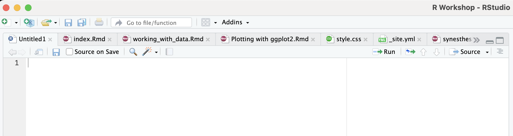

```{r setup, include=FALSE}
knitr::opts_chunk$set(echo = TRUE)
```

## Prelude

Once you have installed both R and RStudio, open RStudio and click on `File`, then `New File`. Next select `R Script`. Alternatively, you can press Ctrl + Shift + N (Windows) or Cmd + Shift + N (Mac)

If you look in the top left quadrant, this is where you can work with your R scripts. In the script window, you can write your analysis and add comments.

<center>{width=70%}</center>

For example, if you click in the script window and write `2 + 5`, you will add a line to you script. This is your first line of code, that’s why you see `1` along the left hand side of the screen. Unlike in the console window, pressing return here will not run the code.

For any section of code that you want to run in an R script, you can highlight the text and press Ctrl/Cmd and Enter/Return at the same time <b> or </b> highlight the text and click on the `Run` icon in the top right of the pane. Running this code will display the result in the console window.

## Introduction

The aim of this section is to explore some of the simple ways in which you can read data into R. We are going to focus on what are referred to as 'Data frames` in R. This is essentially spreadsheet data.

There are many packages and functions available for reading in data. I'll introduce two methods that can be used with common file types. Both methods are straightforward to use. 

The package that you use to read files into R really depends on the type of file that you are trying to read in.
If you are working with Microsoft Excel files, then using `read_excel()` is a nice, simple way of reading in files.
In contrast, `read.csv()` lets you read in files where columns are separated, for example, by tabs, spaces, or commas. Files you might want to open in this way are those ending in `.txt` and `.csv`.

If you are working with more specialist file extensions, you will almost definitely find an available package and documentation to help you work with those files online via a quick Google search.
<br><br>

## The codeless way

Before looking at code, it is good to know some code-free ways of reading in data, which might be especially useful when you are starting out with R.

If working with Excel files, one way to read in data without typing long path names is to click `File` -> `Import Dataset` -> `From Excel...`. You can then search for the file you want. You are also presented with multiple parameters that you can adjust as you wish. The final step is to click `Import`.

<center>
{width="70%"}
</center>
<br>
If working with other files, you can click `File` -> `Import Dataset` -> `From Text (base)...`. One parameter that you might want to change is 'Heading': changing this to 'Yes' will use the first row names as the names for your columns. Again, click `Import` if you are happy with the data. 

This can be particularly useful for finding files for the first time and checking the overall look of the data. This can be seen in the image below:

<br><center>
{width="70%"}
</center>
<br>
When you read in the data using either of these methods, you will see the name of the file. You can copy this code to copy into your R script, to save you from manually having to search for the file each time you want to work with the data.

<br><center>
{width="70%"}
</center>
<br>

### Viewing data

To view the imported dataset, type `View()`, including the name of the data within the parentheses, e.g.:

```
View(file)
```

## Working directory

When you are working in R, you will spend a lot of time working with R scripts. When using scripts, you will want to load in datasets using R code.

Before thinking about loading files, however, it is worth considering where you are loading files from.

R assumes that you are working in a particular folder on your computer. That folder is called your working directory. When loading data, R will assume that it is located in your current working directory.

The working directory is used to tell R where to look for files and where to save them. Knowing your working directory can help you save time when it comes to typing out file names to load into R. For example, if you are loading a file from the working directory, you can simply type the name of the file, rather than having to type out the entire directory path, meaning:

`read.csv("file.csv")` versus something more cumbersome like `read.csv("c:/Users/Me/Documents/file.csv")` 

To find out your current working directory, type `getwd()` into your console and press enter/return.

To change your working directory, type `setwd()`, making sure to put the new directory inside the brackets. For example, `setwd("/Users/Me/Desktop")`. *Note the quotation marks around the filename -- the file won't be found otherwise.*
<br><br>

## Reading in `.csv` and `.txt` files using `read.csv()`

When you start up Rstudio, the `utils` package is automatically loaded, meaning you don't need to do anything. 
You can use this package to import data stored in the CSV format ("comma-separated values" files, ending .csv) using the `read.csv()` function. 

To use this function, put the name of the file that you want to open inside the brackets, e.g. `read.csv("put_me_here_please.csv")`. You can put the file name inside single `' '` or double `" "` quotation marks. It doesn't matter which.

In R, we store values in variables using the assignment operator `<-`. This symbol assigns a value to a variable from right to left. You can also use `=`, but this is generally discouraged.

You can assign a name to the file that you are reading in by typing `<-`.  

For example, typing

```{r}
vowels <- read.csv("Vowels_to_plot.csv")
```

lets you read in a file called `'Vowels_to_plot.csv'` (assuming that the file actually exists in your working directory). The file is then available to work with under the name `vowels`.

The easiest way to display your data is to type the name that you gave the data when you imported it:
```{r, echo = T}
vowels
```

If the dataset is large, this probably isn't something you will want to do, as not all of the information will appear in the console.

Instead, to view the file in its entirety within R, type `View()`, inserting the name of the dataset within the brackets, e.g:

```View(vowels)``` 

*Note the absence of quotation marks*
<br><br>

### File loading issues

There could be several reasons why a file might not load. One reason is that the file name might contain a typo. Another reason could be that the file extension is not correct. If it is still not loading, try typing out the entire path of the file (it could be that the file isn't in your working directory), making sure to use forward slashes (`/`) and not back slashes (`\`).

E.g. `read.csv("c:/Users/ImaFakeman/Documents/data.csv")`
<br><br>

### Additional parameters for `read.csv()`

##### <u>Reading in non comma separated files</u>

If your data are stored in `.txt` files, these can also be accessed using the `read.csv()` function. To do this, you simply have to adjust the `sep` parameter when opening the file.

If you are opening a file and your columns are separated by tabs, for example, you just need to add `sep = "\t"` when opening the file. For data separated by spaces/whitespace, simply add `sep = ""` instead. The default `sep` setting is `,`, so you don't need to type anything for it if reading in a comma separated file, as was shown above.


```{r, echo=T}
read.csv("Vowels_to_plot.txt", sep = "\t")
```
```{r, echo = F}
vowels_txt <- read.csv("Vowels_to_plot.txt", sep = "\t")
str(vowels_txt)
```

The structure of the data can be obtained by typing `str(file)`, where `file` is replaced by whatever you called your data. By typing this you can see whether R has read your data in as characters (`chr`), numbers (e.g. `int` or `num`) or factors (`Factor`), for example. 
<br><br>

##### <u>Setting strings as factors</u>

With `stringsAsFactors`, you can tell R whether it should convert strings (characters/letters or combinations of letters and numbers, e.g. 'cat' 'File001') to factors. `stringsAsFactors` used to be set to `TRUE` by default, but it now appears to be set to `FALSE`.

If you wish to read in strings as factors, simply add ```stringsAsFactors = TRUE``` after the name of the file that you are reading in, like so: 

```{r}
vowels_tab <- read.csv('Vowels_to_plot.txt', sep = "\t", stringsAsFactors = TRUE)
```
```{r}
str(vowels_tab)
```

As you can see, where `Speaker` and `Vowel` were read in as strings earlier, by typing `stringsAsFactors = TRUE`, they are now read in as factors.
<br><br>

##### <u>Setting NA values</u>

An additional parameter that might come in handy is `na.strings`. By default, `read.csv()` takes "NA" to stand for NA values in the dataset. However, it is possible that you may have coded your data differently, so that maybe "0", "na" or "N/A", for example are used to represent NA values. You can specify this using the `na.strings` parameter, typing, for example:

```{r}
vowels_na_1 <- read.csv('Vowels_to_plot.txt', sep = "\t", na.strings = "i")
vowels_na_1
```

In the case above, you can see that "i" is read in as "N/A".

In the example below, multiple values are read in as N/A. This is done by using the function `c()`, which combines/concatenates arguments, meaning it lets you input multiple values at the same time.

```{r}
vowels_na_2 <- read.csv('Vowels_to_plot.txt', sep = "\t", na.strings = c("i", "e", "u", "750"))
vowels_na_2
```


<br>

##### <u>Don't use the first line as headings</u>

By default, `read.csv()` will read the first line of your file in as headings. If your data does not include headings, you can prevent this by typing `header = FALSE`. 

```{r}
vowels_no_header <- read.csv('Vowels_to_plot.txt', sep = "\t", header = FALSE)
vowels_no_header
```

*In the example above, no column names were provided. The first row of the file contained only data. Having set `header` to `FALSE`, R has automatically supplied `V1`, `V2` etc. as headings.*
<br><br>

##### <u>Trim whitespace</u>

A very useful parameter that can be used is `strip.white`. By setting `strip.white` to `TRUE` you can remove leading and trailing spaces. If you do this, then `'A'`, `' A'` and `'A '` will all be read in as `'A'`, rather than three separate names -- something you probably don't want. 

E.g. `trimmed_data <- read.csv("Vowels_to_plot.csv", strip.white = TRUE)`
<br><br>

## `read_excel()` Reading in Excel files

One package you can use to import Excel files is `readxl`. 

To load the `readxl` package, include the following within your R script, or type in directly into the console:

`library(readxl)`

<b>If you don't have `readxl`, you can obtain the package by typing `install.packages('readxl')`.</b>

Following this, you can read in the file by typing `read_excel()`, with the name of the file surrounded by quotation mark placed inside the brackets, 

In R, we store values in variables using the assignment operator `<-`. This symbol assigns a value to a variable from right to left. You can also use `=`, but this is generally discouraged. Make sure that you assign a name to the data, so that you can work with it.

An example can be seen below:


```{r}
library(readxl)
vowels_excel <- read_excel("Vowels_to_plot.xlsx")
```

One small caveat: <b>read_excel can only read in one sheet a time. If you need to work on multiple sheets, they will each need to be loaded as separate objects.</b> You can specify which sheet of the Excel file you want to read in, e.g. `vowels_excel <- read_excel("Vowels_to_plot.xlsx", sheet = 2)`. If you don't, read_excel will automatically load the first sheet. More information can be obtained on this by typing `?read_excel` into the console. 
<br><br>

### Additional parameters for `read_excel()`

##### <u>Trim whitespace</u>

Another potentially useful parameter that is set to `TRUE` by default is `trim_ws`. This removes leading and trailing spaces. What this means in practice is that `'John'`, `' John'` and `'John '` would all be read in as `'John'`, which is incredibly useful, especially if you can't see that you added a space at the end of a variable. When it comes to conducting analyses, if it weren't for the trimming of whitespace, the three Johns would count as separate variables, rather than one, which is probably not what you would want. If for some reason, you need to keep this whitespace, add `trim_ws = FALSE`, when reading in the file (e.g. `dataset <- read_excel("Im_a_little_dataset_short_and_stout.xlsx, trim_ws = FALSE")`)
<br><br>

##### <u>Setting NA values</u>

As with `read.csv()`, you can set NA to be whatever you choose, in this case using the `na` parameter. The default value for NA in `read_excel()` is a blank cell. You could add "na", "NA", "0", or any variable or your choosing by typing something like

`vowels_excel_na <- read_excel("Vowels_to_plot.xlsx", na = c("i", "e", "u", "750"))`


## Saving your file

In order to save your data as a csv file, you need to supply the name of the object to be written, i.e. the name you have given to the data you want to save, using the `x = ` argument followed by the name of the data. Next you need to supply the name of the file using `file = `, ensuring that you include 'csv' at the end of the file name. The 'row.names' argument stops the file from being saved with row numbers as an additional column (It's difficult to think of a time where you ever would want row number to be saved, as row numbers are automatically generated again when you read in the file). The file will be saved into you working directory, unless you specify a file path (e.g. `File = "/Users/ImaFakeman/Documents/My_data.csv"`).

`write.csv(x = vowels_excel, file = "My_saved_vowels.csv", row.names = FALSE)`

```{r}
did_I_save <- read.csv("My_saved_vowels.csv")
did_I_save
```